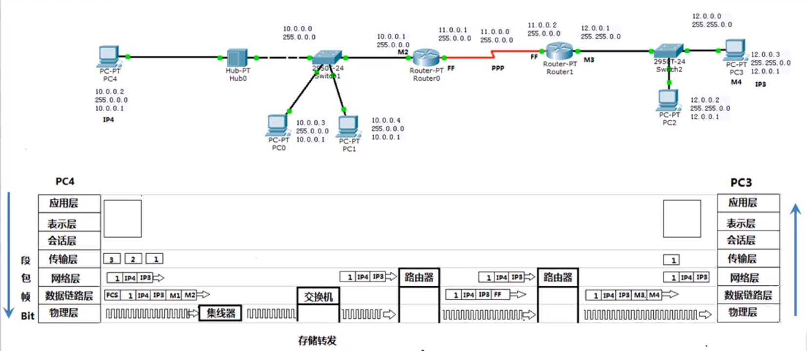

计算机网络笔记(计算机网络第七版 谢希仁著)
================
> 学习的过程中主要以抓包工具Ethereal和虚拟机进行辅助学习, 并以一定的实践进行解释
## 第一章: 概述
### 互联网的组成
```
边缘部分: 由所有连接在互联网上的主机组成, 这部分是由用户直接使用的
核心部分: 由大量网络和连接这些网络的路由器组成, 这部分是为边缘部分提供服务的(提供连通性和交换)
```
### 边缘部分端系统之间的通信方式(计算机之间的通信)
```
一: 客户端-服务器方式(C/S)
  概念: 客户和服务器都是指通信中所涉及的两个应用进程。客户是服务请求方, 服务器是服务提供方
  客户程序:
    <1> 被用户调用后运行, 在通信时主动向远地服务器发起通信。因此, 客户程序必须知道服务器程序的地址
    <2> 不需要特殊的硬件和很复杂的操作系统
  服务器程序:
    <1> 是一种专门用来提供某种服务的程序, 可同时处理多个远地或本地客户的请求
    <2> 系统启动后即自动调用并一直不断地运行着, 被动地等待并接收来自各地的客户的通信请求, 服务器程序不需要知道客户程序的地址	
  注意: 通信可以是双向的, 我们所说的B/S其实是C/S的一种特殊情况
二: 对等连接方式P2P
  概念: 是指两台主机在通信时不区分哪一个是服务请求方哪一个是服务提供方, 只要两台主机都运行了对等连接软件(P2P软件), 它们就可以进行平等的、对等连接通信
```
### 报文&&数据段&&分组&&包
```
报文: 通常我们把要发送的整块数据称为报文, 比如"你好"这个数据在经过应用层(应用层, 表示层, 会话层)的处理后则形成一个报文
数据段: 在发送报文之前, 先把较长的报文划分为一个个更小的等长数据段
分组&包: 对数据段加入一些头部(由一些必要的控制信息构成), 就构成了一个分组, 也叫包
```
### 核心部分: 分组交换
```
核心部分的主要部件是路由器, 它是一种专用计算机(不叫主机), 路由器是实现分组交换的的关键部件, 任务是转发收到的分组

电路交换主要特点: 经过"建立连接"(占用通信资源, 物理线路) => "通话"(一直占用通信资源) => "释放连接"(归还通信资源)三个步骤的交换方式电路交换会在主叫端 => 被叫端之间建立一条连接, 也就是一条专用的物理通路, 在通话时间内, 通话的两个用户时钟占用端到端的通信资源

分组交换的主要特点: 采用存储转发技术, 在传送数据之前不必先占用端到端的链路的通信资源, 只有在哪段链路上传送才占用这段链路的通信资源, 分组到达一个路由器后, 先暂时存储下来, 查找转发表, 然后从一条合适的链路转发出去, 分组在传输时就这样一段段的断续占用通信资源, 还省去了建立连接和释放连接的开销

归纳: 
  电路交换: 整个报文的比特流连续地从原点直达终点, 就好像在一个管道中传送
  报文交换: 整个报文先传送到相邻节点(路由器), 全部存储下来后查找转发表, 转发到下一个节点
  分组交换: 单个分组(整个报文的一小部分)传送到相邻节点, 存储下来后查找转发表, 转发到下一个节点 
```
### 计算机网络的性能指标
```
一： 速率： 连接在计算机网络上的主机在数字信道上传送数据位数的速率, 也称为data rate或者bit rate
           宽带的100M是指每秒传输100M个比特位, 而我们看到的下载速度等10M是指每秒传输10M个字节, 所以其传输的基本单位是不一样的
二：带宽：数据通信领域中, 数字信道所能传送的最高数据率
三：吞吐量：即在单位时间内通过某个网路的数据量, 总的速率, 比如下载一个电影的速度是4M/s, 下载一个游戏的速度是3M/s, 两个下载
           同时进行, 所以同一时间内网卡的数据流量是7M/s, 即为吞吐量          
四：时延：一个数据（报文, 数据包等）从一个地方传送到另一个地方需要消耗的时间
      发送时延：一个文件从一台电脑开始发送到发送结束消耗的时间 => 发送时延 = 数据块长度(比特) / 信道带宽(比特/秒)
      传播时延：数据包在网线上传输的时间
      处理时延：路由器处理数据包的出口, 比如从A电脑发送了多个数据包, 到了路由器的时候, 需要对不同的数据包选择不同的传输路径, 消耗的时间 即为处理时延
      排对时延：路由器上, 有其他的包还没发送完成, 此时后面的包需要排对, 消耗的时间即为排对时延
五：时延带宽积: 传播时延 * 带宽, 表示同一时间在传输路径上最多有多少个比特在传输          
六：往返时间：从发送方发送数据开始, 到发送方收到接收方确认信息
七：利用率
      - 信道利用率: 有数据通过时间 / (有 + 无) 数据通过时间
      - 网络利用率：信道利用率加权平均值
```
### OSI参考模型(法定标准)
```
应用层: 所有能和用户交互产生网络流量的程序(如QQ, 但是记事本是不会产生流量的, 所以其不属于应用层), 
        主要协议: FTP(文件传输), SMTP(电子邮件), HTTP(万维网)
表示层: 用于处理在两个通信系统中交换信息的表示方式(语法语义), 主要协议: JPEG, ASCII
        功能一: 数据格式变换(翻译官)
        功能二: 数据加密解密
        功能三: 数据压缩和恢复(如视频聊天摄像头捕捉的头像是比较大的, 需要进行压缩再传输)
会话层: 向表示层实体/用户进程提供建立连接并在连接上有序地传输数据, 这叫会话, 
        也叫建立同步(如打开两个网页, 对它们分别建立了一个会话, 对一个网页地操作不会影响其它网页), 
        主要协议: ADSP, ASP
        功能一: 建立、管理、终止会话
        功能二: 使用校验点可使会话在通信失效时从校验点/同步点继续恢复通信, 实现数据同步, 
                如大文件的传输出现了断网, 则可以在校验点位置进行重新传输
传输层: 负责主机中两个进程的通信, 即端到端的通信, 传输单位是报文段或用户数据报, 主要协议: TCP, UDP
        功能一: 可靠传输(在目标主机返回了确认信息时才发送下一个数据包, 如果一定时间后没有确认信息则补发)、
                不可靠传输(一个数据包就可以解决数据发送), 可靠传输会传输多个包, 只有前一个包发送成功才发送下一个
        功能二: 差错控制
        功能三: 流量控制, 防止缓存满, 发送方和接收方的速率不一样(端对端的流量控制)
        功能四: 复用分用, 通过端口号来区分传输层的数据传送到哪个应用程序 
网络层: 主要任务是把分组从源端传送到目的端, 为分组交换网上的不同主机提供通信服务, 主要协议: IP, IPX, ICMP, IGMP, ARP, RARP,OSPF,        传输单位是数据报, 对于太大的数据报, 会将其分为多个分组来进行发送
        功能一: 路由选择(最佳路径)
        功能二: 流量控制
        功能三: 差错控制
        功能四: 拥塞控制, 如所有节点都来不及接收分组, 而要丢弃大量分组的话, 网络就处于拥塞状态。
                因此要采取一定的措施来缓解这种拥塞
        设备：路由器        
数据链路层: 主要把网络层传下来的数据报组装成帧, 传输单位是帧, 主要协议: SDLC, HDLC, PPP, STP
        功能一: 成帧(定义帧的开始和结束)
        功能二: 差错控制(帧错+位错)
        功能三: 流量控制(点对点的流量控制)
        功能四: 访问控制, 控制信道的访问(点对点的ADSL网络, 需要账号密码)
        设备：交换机
物理层: 主要任务是在物理媒体上实现比特流的透明传输, 传输单位是比特, 透明传输是指不管所传数据是什么样的比特组合, 
        都应当能够在链 路上传送, 主要协议: Rj45, 802.3
        功能一: 定义接口特性(如插口的孔的个数)
        功能二: 定义传输模式(单工、半双工、双工), 单工即固定了发送方和接收方, 半双工即双方都可以是发送方, 但是同一时间只能由
                一方发送数据, 双工即双方可以同时发送数据, 如打电话
        功能三: 定义传输速率(如何在物理链路上传输更快的速度)
        功能四: 比特同步
        功能五: 比特编码(用什么样的电压表示0和1)
        设备：集线器(放大信号)

TCP/IP参考模型(事实标准): 应用层, 传输层, 网际层, 网络接口层 
5层参考模型: 应用层(生成报文), 传输层(报文切割为报文段/数据段), 网络层(数据报/分组/包), 数据链路层(数据段成帧), 物理层(帧成比特流) 				
```
## 第二章: 物理层
### 物理层的基本概念
```
物理层: 解决如何在连接各种计算机的传输媒体上传输数据比特流, 而不是指具体的传输媒体(如光纤, 双绞线等不属于物理层)
主要任务：确定与传输媒体的接口有关的特性
        机械特性: 接口形状, 大小, 引线数目
        电气特性: 例如规定电压范围(-5V到+5V)
        功能特性: 例如规定-5V表示0, +5V表示1
        过程特性: 规定建立连接时各个相关部件的工作步骤  
```

### 数据通信的基础知识
#### 常用术语
```
通信的目的：传送消息
数据：运送消息的实体
信号：数据的电气的或者电磁的表现
    "模拟信号" 代表消息的参数的取值时连续的
    "数字信号" 代表消息的参数的取值是离散的
码元: 在使用时间域的波形表示数字信号时, 则代表不同离散数值的基本波形就称为码元。在数字通信中常常用时间间隔相同的符号来表示一个二进制数字, 
      这样的时间间隔内的信号称为二进制码元。而这个间隔被称为码元长度。一码元可以携带nbit的信息量
```
#### 信道
```
概念: 一般是用来表示向一个方向传送信息的媒体
信道中通信的方式: 
    - 单向通信(单工通信): 只能由一个方向的通信而没有反方向的交互, 例如电视机接收电视信号, 只能由电视台那边发送信号过来
    - 双向交替通信(半双工通信): 通信的双方都可以发送信息, 但不能双方同时发送, 也不能同时接收。例如对讲机
    - 双向同时通信(全双工通信): 通信的双方可以同时发送和接收信息。例如电话
```
#### 基带信号&带通信号
```
基带信号(在数字信道上传输): 来自信源的信号。像计算机输出的代表各种文字或图像文件的数据信号都属于基带信号。基带信号就是发出的直接表达了
                          要传输的信息的信号, 比如我们说话的声波就是基带信号, 再比如由物理层发出的二进制比特流也是基带信号
带通信号(在模拟信道上传输): 把基带信号经过载波调制后, 把信号的频率范围搬移到较高的频段以便在信道中传输

在传输距离较近时, 计算机网络都采用基带传输方式, 由于近距离范围内基带信号的衰减不大, 从而信号内容不会发生改变。
如计算机到监视器、打印机等外设的信号就是基带传输的, 而在网络上传输时, 由于传输距离较远(如北京到上海), 此时为了
能够防止信号衰减严重, 需要将基带信号调制成带通信号来在模拟信道上传输 
```

#### 基带信号的编码
```
编码的原因: 由于计算机传送的是二进制数据01, 那么在网络中传输时需要将其转换成电磁波来进行传输, 则用多大的电压来表示一个0和一个1
            就是对基带信号进行编码。
编码方式:
    单极性不归零码: 只使用一个电压值, 用高电平表示1, 没电压表示0
    双极性不归零码: 用正电平和负电平分别表示二进制数据的1和0, 正电平和负电平的值是相等的
    单极性归零码: 以高电平和零电平分别表示二进制码1和0, 而且在发送码1时高电平在整个码元期间T只持续一段时间x, 其余时间返回零电平
                (例如 11, 则其应该是连续的两个高电平信号, 但是每一个高电平信号代表完1后立马恢复成零电平, 然后再跳到高电平, 再恢复成零电平)
    双极性归零码: 正负零三个电平, 正电平代表1, 负电平代表0, 每代表完一个1和0都要跳转到零电平      

    不归零编码特点：编码容易, 但是没有检错功能, 无法判断一个码元的开始和结束, 以至于收发双方难以保持同步, 例如发送10个1, 则收方收到的是一连串的
                   高电平, 从而无法判断多少个1   
    曼彻斯特编码: 信号由低跳到高, 则高电平代表0, 信号由高跳到低, 则低电平代表1, 如果两个信号之间没有进行跳转,
                则两个信号的电平是一样的, 则说明没有网络(需要取样两次)
    差分曼彻斯特编码: 如果后一个是0则将后一个的电平和前一个保持一致, 如果后一个是1, 则将后一个的电平进行跳变,
                    比如两个连续的11, 其电平的表示方式是不一样的, 因为要进行跳变                    
```


- 基带信号

    

- 曼彻斯特编码

    
    

- 差分曼彻斯特编码

    
    

#### 基带信号的调制(将数字信号转换为模拟信号) 
- 调幅: 载波的振幅随基带数字信号而变化

    
- 调频: 载波的频率随基带数字信号而变化

    
- 调相: 载波的初始相位随基带数字信号而变化(对二进制0用开始从中点向上, 结束时从下到中点的波表示, 对二进制1用开始从中点向下, 结束时从上到中点的波表示)

    

#### 奈氏准则
```
奈氏准则: 在任何信道中, 码元传输的速率是有上限的, 否则就会出现码间串扰的问题, 使接收端对码元的识别成为不可能, 即当传输
         速率过快的时候, 一个码元的大小(宽度)就会变得很短, 如___变为了_ , 那么识别速度一定的情况下就可能导致识别失败
         如果信道的频带越宽, 也就是能够通过的信号高频分量越多, 那么就可以用更高的速率传送码元而不出现码间串扰
一句话: 奈氏准则告诉我们即使是没有干扰的情况下, 传输速率也是有上限的
```
#### 香农公式
```
香农公式: C = W * log(1 + S/N) b/s
        C：信道的极限传输速率, 即在带宽一定, 有噪声干扰的信道下, 能达到的极限、无差错的信息传输速率
        W：信道的带宽
        S：信道内所传信号的平均功率
        N：信道内部的噪声功率

例子1: A对B面对面说200个字, 在没有噪声干扰的情况下, 此时A的说话速度(带宽)能够让B无差错的听到说的话, 此时突然传来了
    工地的施工声音, 噪声很大, 为了能够让B无差错的听到这200个字, A需要降低说话的速度(带宽)才能达到

例子2: 电脑与WIFI路由器的距离为2米, 此时可以通过看网络状态信息中速率很高, 当电脑与WIFI路由器之间隔了一道墙, 或者一个房间
    此时为了达到无差错的信息传输, 需要降低传输速率

香农公式表明:
    <1> 信道的带宽(W)或信道中的信噪比(S/N)越大, 则信息的极限传输速率就越高
    <2> 只要信息传输速率低于信道的极限信息传输速率, 就一定可以找到某种方法来实现无差错的传输
    <3> 若信道带宽W或信噪比S/N没有上限(不可能), 则信道的极限信息传输速率C也就没有上限  
```
#### 基于香农公式提高传输速率
```
问题: 
    奈氏准则告诉我们传输速率是有上限的, 香农公式告诉我们带宽的大小和信噪比能够影响极限传输速率, 那么在带宽已经确定的信道,
    以及信噪比不能再提高时, 怎么去提高传输速率呢?

解决方案:
    用编码的方式让一个码元携带更多的比特, 例如: 加入我们的基带信号为 101011000110111010..., 如果直接传送, 则每一个码元所携带
    的信息量是1bit, 而编码是将二进制编制成一定的相位(如果为相位调制), 那么将3个比特作为一组, 即101, 010, 000, 110, 111, 010...
    3个比特共有8种情况, 则用8种不同的相位进行调制, 那么原来用18个码元才能表示的数据就用6个码元就可以表示了, 这样以相同速率去传送
    码元(带宽一定), 信噪比又一定的情况下, 就极大的提高了传输速率, 即使得传输速率无限的接近香农公式的值
```
### 物理层下面的传输媒体:
#### 导向传输媒体: 电磁波沿着固体媒体传播
- 双绞线
    - 屏蔽双绞线STP
    - 无屏蔽双绞线UTP
- 同轴电缆
    - 50Ω同轴电缆: 用于数字传输, 多用于基带传输, 也叫基带同轴电缆
    - 75Ω同轴电缆: 用于模拟传输, 即宽带同轴电缆
- 光缆(光纤)  

   

#### 非导向传输媒体: 无线传输

### 信道复用技术
#### 频分复用FDM: 用于打电话, 并且可以多次频分复用, 到达目的地后进行过滤和分用
```
不同的人之间的进行通话:如A-B, C-D, E-F 对A,B,C三者的声音采用不同的频率去进行声音的描述, 然后将这些频率经过调制, 从而在传输过程中不容易衰减
然后对这些调制后的频率叠加成一个总的频率表示, 最后在一个信道中进行这个频率的传输, 到达目的地后通过过滤器进行过滤, 过滤完后再进行解调, 解调完后
对频率进行还原, 此为分用。
```
  


#### 多次频分复用

 

#### 时分复用TDM
```
弊端: 可能会造成线路资源的浪费, 使用时分复用系统传送计算机数据时, 由于计算机数据的突发性质,
      用户对分配到的子信道的利用率一般是不高的。
```

 
 
 

#### 统计时分复用STDM: 对时分复用进行优化, 只接收有效值, 并对这些有效值进行标记, 这样接收方才能识别

 

#### 波分复用WDM：光的频分复用

 

#### 宽带接入技术      
```
ADSL上网实现机制: DMT技术
    利用电话线来同时进行打电话的信号和网络信号的传输, 其中用到的技术是频分复用技术, 电话线本身实际可通过的信号频率假设为1MHz, 那么将0-4kHz的
    频率给电话使用, 将40kHz-1100kHz给网络使用, 其中给网络使用的频率又进行细分, 将其分为多个信道, 因为上网主要的流量传输在于下载, 而对网页等请求则为上传, 
    上传用的流量是比较小的, 所以将这些信道中的25个用于上行信道, 249个用于下行信道, 所以这也是ADSL叫非对称数字用户线路的意思, 即提供的上行和下行宽带速率不对称             
光纤同轴混合王HFC: ADSL是复用电话线进行网络的数据通信, 而该技术是复用有线电视的同轴电缆, 同样是使用频分复用来对电视信号和网络信号进行分发 
FTTH技术(光纤到家)：直接将网络进行光纤传输, 不复用电话线和电视线, 还有光纤到大楼, 到路边
```

## 第三章: 数据链路层
### 常用术语
```
链路: 是一条点到点的物理线段, 中间没有任何其它的交换节点, 一条链路只是一条通路的一个组成部分, 例如计算机A到交换机的那条网线
数据链路: 除了物理链路外(即链路), 还必须有通信协议来控制这些数据的传输。将实现这些协议的硬件和软件加到链路上, 就构成了数据链
         路。 如网卡实现了协议, 网卡加上网线就是数据链路
帧: 数据链路层传送的是帧, 对网络层传过来的数据包/分组添加一些数据, 比如帧头, 帧尾信息, 物理地址, 以及校验值(即数据的个数等)
```
### 数据链路层使用的信道类型
```
点到点信道：这种信道使用一对一的点对点通信方式, 如路由器A只与路由器B相连, 那么路由器A就只能与路由器B进行通信, 即一对一通信
广播信道：这种信道使用一对多的广播通信方式, 因此过程比较复杂, 广播信道上连接的主机很多, 因此
         必须使用专用的共享信道协议来协调这些主机的数据发送, 例如：多台计算机连接在一个集线器上, 计算机A给计算机B发送信息,
         计算机C,D都能收到信息, 只是会判断这些信息不是属于自己的, 从而不进行接收, 这叫广播信道
```
### 数据链路层的主要功能
```
数据链路层在物理层提供服务的基础上向网络层提供服务，其最基本的服务是将源自网络层来的数据可靠地传输到
相邻节点地目标机网络层。其主要作用是加强物理层传输原始比特流的功能，将物理层提供的可能出错的物理连接改造
成为了无差错的数据链路，使之对网络层表现为一条无差错的链路
```
### 数据链路层的三个基本问题
#### 封装成帧
```
由于在网络中传输的数据很多, 那么就需要界定多个不同的数据, 所以需要将它们封装成帧, 
将网络层传下来的数据包作为数据链路层的数据部分, 然后在该数据的前后添加一个帧的开始和结束标记, 
一般是一个字符, 例如开始帧0000 0001, 结束帧0000 0100
```
#### 透明传输
```
由封装成帧引起的问题, 在数据部分出现了帧的开始或者结束的字符, 需要通过转义字符ESC来进行标记, 对数据部分
本身出现的帧的开始字符, 结束以及转义字符进行转义, 网卡在接收数据时就会对转义字符进行视而不见, 所以叫透明传输
```
##### 实现透明传输的方法
```
字符填充法: 利用转义字符如ESC来进行对非标记字符进行转义, 接收端则将这个转义字符去掉
零比特填充法：假如帧首和帧尾都是01111100, 则对于数据部分如果出现了连续的5个1, 则在1的后面填充一个0
违规编码法: 假如我们对基带信号的编码为曼彻斯特编码, 那么左高右低则为0, 左低右高则为1, 这时可以将帧首和帧尾
            用左低右低或者左高右高的违规编码方式来表示
```
#### 差错控制            
```
传输过程中因为存在干扰可能会产生比特差错, 1可能变成0而0也可能变成1, 当发现了传过来的这个帧有错误时, 
此时该数据链路层(可能是路由器的数据链路层)就会将这个帧丢弃, 当源计算机在一定的传输时间过去后还没有收到
目标计算机的确认信息时，就会重新发送一次该丢弃的帧
```        
##### 实现差错控制: 通过CRC循环冗余检验算法获得帧检验序列FCS
```
CRC算法的基本思想是将传输的数据当做一个位数很长的数。将这个数除以另一个数。得到的余数作为校验数据附加到原数据后面
实现：通过生成多项式形成被除数和除数，被除数即要发送的数据加上(除数位数 - 1个0)，例如被除数为101001，除数为1101
     则被除数为101101加上3个0即101001000，然后对被除数和除数进行异或运算, 如果此时不够位数则与0000进行异或运算
特点: 
    <1> 这种检测方法并不能确定究竟是哪些个比特出现了差错, 使用位数足够多的除数P, 那么出现检测不到的差错的概率就很小很小
    <2> 使用该技术只能做到无差错接收数据, 即只接收正确的数据
```

   

### 局域网设备的演变：总线型网络=>集线器=>网桥=>交换机
#### 总线型网络
```
采用单根传输线作为总线，所有计算机都共用一条总线，特点：当其中一台计算机发送信息给同一个局域网中另一台
计算机时，信息会以广播的形式发送到局域网中所有的计算机，这些计算机会将目标地址与其本身相同的信息接收，不
相同的信息则拒绝接收
```
#### 集线器
```
将总线型网络改造成了星型网络，其实只是在物理上表现成星型网络，逻辑上仍然是总线型网络
总线型网络缺点：多台计算机同一时间内只能有一台计算机发送信息给其它计算机，如果多台计算机同时发送
              则会产生冲突，并且在这种网络下的计算机只能是半双工通信
```
#### 网桥
```
局域网的扩充：多个集线器一起连接到一个集线器上，从而扩充了局域网，但同时使得每一个集线器单独的冲突域变成了多个集线器合在
             一起的大的冲突域。 
网桥：用于解决集线器来进行局域网扩充的问题，隔离冲突域, 从而解决了扩充局域网下集线器冲突域变大的问题，网桥通过自学习算法记录一个
      MAC地址属于哪个网段，下次则可以直接将数据发送到这个接口属于的网段，减少了广播的范围。               
```

   

#### 交换机(存储转发)
```
交换机内部的CPU会在每个端口成功连接时，通过将MAC地址和端口对应，形成一张MAC表，在通信时，只将数据报发送到指定
MAC地址的计算机，从而避免了大量广播。
```
### 两种情况下的数据链路层
#### 使用点到点信道的数据链路层
```
PPP协议：用户通过ADSL来进行拨号上网的时候，使用的就是PPP协议，点到点信道通信
    应该满足的要求：
        简单、封装成帧、透明性、多种网络层协议、多种类型链路、 差错检测、检测连接状态
        最大传送单元、网络层地址协商、数据压缩协商
    不需要满足的要求：
        纠错、流量控制、序号、多点线路、半双工或单工链路    
PPP协议的组成：
    一：数据链路层协议可以用于异步串行或同步串行介质
    二：它使用LCP(链路控制协议)建立并维护数据链路连接(身份验证、计费功能)
    三：网络控制协议(NCP)允许在点到点连接上使用多种网络层协议
PPP协议的帧格式: 首部  信息部分(不超过1500字节)  尾部   
    首部: 由三个分别是1个字节的帧首部、地址字段、空闲字段，以及一个2个字节的协议构成
            其中帧首部代表帧的开始，地址字段和空闲字段暂时并没有被使用，所以是固定的表示
            2个字节的协议是用于表示后面的信息部分采用的协议(如IP协议则是信息部分就是IP数据报)
    尾部：由一个2个字节的FCS检验序列和1个字节的帧尾部构成
PPP协议的工作状态:
    <1> 用户点击连接拨号上网, 则用户计算机与ISP之间就建立了一条物理连接
    <2> 用户计算机向ISP发送一系列的链路控制协议LCP分组(封装成多个PPP帧), 这些分组主要是一些参数信息, 
        如账号密码进行验证等, 如果响应成功则建立完成一个LCP连接
    <3> 通过NCP协议建立NCP连接, 接入的用户获得一个临时的IP地址
```
#### 使用广播信道的数据链路层
```
点对点的广域网的通信协议是PPP，局域网以太网的通信协议是载波监听多点接入/碰撞检测=====CSMA/CD协议
使用CSMA/CD(载波监听)协议的以太网不能进行全双工通信而只能进行双向交替通信(半双工通信)
多点接入：表示许多计算机以多点接入的方式连接在一根总线上
载波监听：是指每一个站在发送数据之前先要检测以下总线上时分有其他计算机在发送数据，如果有，则暂停发送数据，
         等待一个随机的时间后再发送
碰撞检测：发送前检测信道是否空闲，发送时仍然不停的检测信道是否空闲，一旦遇到多台计算机同时发送时，即
         检测到碰撞，此时需要对碰撞进行处理
争用期: 以太网的端到端往返时延2S称为争用期, 或碰撞窗口, 通常, 取51.2us(微秒)为争用期的长度
        对于10Mb/s以太网, 在争用期内可发送512bit, 即64字节
        以太网在发送数据时, 若前64字节未发生冲突, 则说明此时信道空闲
二进制指数类型退避算法: 用于碰撞后重传时间的计算, 即解决碰撞的方式        
```  
##### MAC帧格式
```
目的地址(6个字节)  源地址(6个字节)  类型(2个字节) IP数据报(46-1500字节) FCS(2个字节)
```
### VLAN虚拟局域网
```
VLAN的表示：
    交换机的使用使得VLAN的创建成为可能，首先由下图所示: 三层楼中每一层都有一个交换机，每层楼的计算机本应该
    在该层楼的交换机下构成一个局域网，现在需要将三层楼中同一列的计算机之间才构成局域网，但是每一层楼的计算机
    都连接在其自身层的交换机上，此时需要利用VLAN技术，将同一台交换机分割成三个逻辑的局域网，即VLAN，利用接口来
    区分，比如1-10口为VLAN1，11-20为 VLAN2，21-30为VLAN3，这样一台交换机就分成了三个局域网，但是不同楼的需要通过
    交换机中的干道链路连接起来，就是交换机A与交换机B通过干道链路的线连接起来，这个干道链路可以通过多个网段(局域网)的信息
    当交换机A中接在1口的计算机与交换机B中接在5口的计算机(由于都属于VLAN1，所以是局域网)通信时，会将数据进行封装，添加ISL
    标记来在干道链路上传输时区分属于哪个VLAN，从而发送到指定的计算机
```
    

## 第四章: 网络层
### 网络层提供的两种服务
#### 虚电路服务
```
两台计算机进行通信时, 应当先建立连接(在分组交换中是建立一条虚电路), 以预留
双方通信所需的一切网络资源 
```
#### 数据报服务
```
网络层向上只提供简单灵活的、无连接的、尽最大努力交付的数据报服务
网络在发送分组时不需要先建立连接。每一个分组独立发送，与其前后的分组无关(不进行编号)
网络层不提供服务质量的承诺。即所传送的分组可能出错、丢失、重复和失序，当然也不保证分组传送的时限
```
#### 两种服务的对比
```
<1> 虚电路服务的思路是可靠通信应当由网络来保证，数据报服务应当由用户主机来保证
<2> 虚电路服务在发送数据前必须建立好连接，即数据的传送只能走一条路径，而数据报服务不需要提前建立连接
<3> 虚电路服务的分组转换在属于同一条虚电路上的分组必须按照同一路由来进行转发，而数据报服务的每个分组
    可以独立选择路由 
<4> 一旦一个节点出现故障，那么所有通过该节点的虚电路都会不能工作，而数据报服务则路由可以发生改变
<5> 虚电路服务的分组顺序是按发送顺序的，先发先到，而数据报服务因为路由可以不同，所以到达终点的顺序不一样
<6> 虚电路服务中端到端的差错处理和流量控制由网络负责，也可以由用户主机负责，而数据包服务则由用户主机负责
```
### 网络互联的设备
```
物理层中继系统：转发器(信号放大)，可以理解为集线器
数据链路层中继系统：网桥或者交换机(二层设备, 可以识别MAC地址)
网络层中继系统：路由器(三层设备, 可以进行路由选择)
网络层以上的中继系统：网关(路由器的地址)
```
### 网际协议IP协议
#### IP地址&硬件(MAC)地址
```
IP地址:
    由网络ID(网络部分)和主机ID(主机部分)构成, 同一个网段的第一个IP地址主机部分全是0所以不使用, 
    最后一个IP地址主机部分全是1作为广播地址使用, 每个IP地址全球唯一(除了私有地址)
MAC地址:
    MAC地址可以理解为网卡的地址, 每一个网卡的MAC地址全球唯一
IP地址在计算机通信传送数据包时, 数据包的源IP地址和目的IP地址通信过程中不会发生改变, 而源MAC地址
和目的MAC地址会不停的进行改变, 每一跳都要进行改变, IP地址决定了数据包的起点和终点, 而MAC地址决定
了数据包下一次应该到达的路由器或者主机
```
#### IP地址的分类
```
IP地址表示: xxx.xxx.xxx.xxx
划分的依据: 第一个xxx为0000 0000(0),1000 0000(128),1100 0000(192),1110 0000(224)...
A类地址：第一个xxx是0-126(0000)的地址是A类地址, 默认子网掩码为255.0.0.0
B类地址：第一个xxx是128-191(1000)的地址是B类地址, 默认子网掩码为255.255.0.0
C类地址：第一个xxx是192-223(1100)的地址是C类地址, 默认子网掩码为255.255.255.0
D类地址：第一个xxx是224-239(1110)的地址是D类地址, 用于多播地址的使用
E类地址：第一个xxx是11110000的地址是D类地址, 保留未使用
```
#### 特殊的几个IP地址
```
127.0.0.1 本地回环地址
169.254.0.0 在连接网络后，没有获取到IP地址时，计算机自动分配的IP地址
保留的私网地址(外网是不通的,即互联网中不知道怎么走到这些网络地址):
    A类地址：10.0.0.0
    B类地址：172.16.0.0  --- 172.31.0.0
    C类地址：192.168.0.0 --- 192.168.255.0
```
#### 子网掩码
```
用来指明一个IP地址中哪些位标识的是主机所在的子网以及哪些位标识的是主机的位掩码。
即标识网络部分和主机部分,当在发送数据时, 如果通过子网掩码发现目标地址和源地址在
同一个网段, 则直接将数据包找到指定的MAC地址发送,在同一个网段则通过路由转发
```
#### 子网掩码求网段
```
已知IP为192.168.10.127, 子网掩码为255.255.255.0, 利用IP地址与子网掩码作与运算得网段,
子网掩码转换为二进制是24个1,任何二进制和1进行与运算得其本身, 和0作与运算得0, 
所以求得网段为192.168.10.0
```
#### 划分子网
```
目标：IP为192.168.0.0, 子网掩码为255.255.255.0, 将其细分为两个网段
步骤:
    <1> 由IP地址与子网掩码作与运算, 得192.168.0为网络部分, 后面的为主机部分
    <2> 利用主机部分来进行划分子网, 主机部分为0000 0000, 如果主机部分第一位再继续
        作为网络部分则可划分成两个网段, 如果主机部分前两位作为网络部分则可以将其划
        分为4个网段,因为两位二进制有4种情况(00 10 11 01)
    <3> 划分成两个网段, 则子网掩码为255.255.255.1000 0000, 即255.255.255.128   
    <4> 第一个网段有效地址为192.168.0.1-192.168.0.126(192.168.0.0主机部分为0不使用,
        192.168.0.127主机部分为1作为广播地址);
```
#### IPV4数据报格式: 由首部(固定部分 + 可选字段)和数据两部分组成
```
首部的前一部分是固定长度, 共20字节, 是所有IP数据报必须具有的
在首部的固定部分的后面是一些可选字段, 其长度是可变的
固定部分：
    版本：标明是IPV4还是IPV6
    首部长度：由固定部分+可选字段的长度
    区分服务：数据包传送的优先级
    总长度：首部 + 数据部分的长度
    标识：一个计数器, 每产生一个数据包就加1, 不是序号, 如果一个数据包分片, 那么它们的标识是一样的
    标志：表名这个数据包是否是分片的(有些数据包太大, 则将其再细分为几个小包, 每个包都有首部)
    片偏移：分片后每一个包相对于起始包的偏移量
    生存时间(TTL)：是一个数字, 表示最多还可以经过的路由器的个数, 原值是128, 没经过一个路由器减1
    协议：指明数据部分的协议, 是一个数字, 可以是TCP协议, UDP协议...
    首部检验和：用于检查首部信息是否出现错误
    源地址：发送方的IP地址
    目的地址：接收方的IP地址
可选部分：用来支持排错、测量以及安全等措施, 为了增加IP数据包的功能, 同时使得IP数据包的首部长度是可变的
```
#### IPV6数据报格式：由基本首部 + 有效载荷（扩展首部(可有可无) + 数据）
```
基本首部(固定40字节)：
    版本：协议的版本，对IPV6该字段是6
    通信量类：数据报传送的优先级, 类似于IPV4中的区分服务
    流标签：流是互联网络上从特定源点到特定终点的一系列数据报。所有属于同一个流的数据报都具有同样的流标签
    有效载荷长度：指的是下面的有效载荷字段的长度(扩展首部和数据的总大小)
    下一个首部：当有效载荷中没有扩展首部的时候, 该字段的功能和IPV4协议字段的功能一样, 
               表示数据部分应该交付给IP层上面的哪一个高层协议当有扩展首部的时候,该字段
               的值就标识第一个扩展首部的类型 
    跳数限制：相当于IPV4中的TTL生存时间
    源地址/目标地址：源IP和目标IP，都是128位
有效载荷：
    扩展首部：相当于IPV4首部的可选字段, 可以有多个, 分片，鉴别，目的站选项等等,这些数据由
             路径两端的源点和终点的主机来处理
    数据：发送的数据
```
#### IP数据包分片

 

#### IPV4向IPV6的过渡
```
双协议栈：
    使得一部分主机能够同时支持IPV4和IPV6, 双协议栈的主机通过DNS服务器获取到的IP地址来判断
    目的主机是采用哪个版本的IP协议，从而使得自己发送的数据包采用该版本的IP协议，当IPV6协议的
    IP数据包需要经过IPV4的路由器或者主机时，会将该数据包的首部转换为IPV4数据包首部格式，反之
    也是一样的，缺点是IPV4转IPV6时，流标签字段的值会损失掉
隧道技术：
    在IPV6数据包要进入IPV4网络时，将IPV6数据包封装成IPV4数据包，作为IPV4数据包的数据部分，
    此时需要将协议字段设为41(表示数据部分时IPV6数据包)
```
### 地址解析协议arp协议: IP地址与MAC地址的映射
```
使用过程：在数据链路层需要添加目的MAC地址时, 先检查ARP高速缓存, 有对应表项则写入MAC帧, 
         没有则用目的MAC地址为FF-FF-FF-FF-FF-FF的帧封装并广播ARP请求分组, 询问哪台主机
         IP地址是xxx,同一局域网中所有的主机都能收到该请求。目的主机收到请求后就会向源主机
         单播一个ARP响应分组, 告诉源主机我的IP地址是xxx, 我的MAC地址是xxx, 源主机收到后
         将此映射写入ARP缓存, 同时将该MAC地址写入帧中。

arp -a: 查看所有的apr解析的静态MAC地址
arp -s IP地址 MAC地址：修改IP地址所在 的MAC地址
route print: 查看路由表
route add 网段 mask 子网掩码 路由地址A: 添加到网段的路由地址,如果要访问该网段,那么下一跳就要到路由地址A         
```
### 网际控制报文协议ICMP：差错或异常报告，网络探询, 一般配合ping命令使用
```
ICMP允许主机或路由器报告差错情况和提供有关异常情况的报告 
ICMP报文的格式：类型 + 代码 + 检验 + 数据部分(长度取决于类型)
类型：ICMP差错报告报文和ICMP询问报文
如果虚拟机ping不通主机，有可能是主机的防火墙不允许ping
防火墙=>高级设置=>入站规则=>启动虚拟机IPV4入站规则
```
### 因特网的路由选择协议
#### 动态路由算法
```
链路状态路由算法(全局性)OSPF: 所有路由器掌握完整的网络拓扑和链路费用信息
距离向量路由算法(分散性)RIP: 路由器只掌握物理相连的邻居及链路费用
```
#### 分层次的路由选择协议
```
原因：
    <1> 因特网规模很大
    <2> 许多单位不想让外界知道自己的路由选择协议, 但还想连入因特网
自治系统AS: 在单一的技术管理下的一组路由器, 而这些路由器使用一种AS内部的路由选择协议和共同的
           度量以确定分组在该AS内的路由，同时还使用一种AS之间的路由协议以确定在AS之间的路由。
           一个AS内的所有网络都属于一个行政单位来管辖，一个自治系统的所有路由器在本自治系统内都
           必须连通 
内部网关协议IGP：一个AS内使用的RIP、OSPF
外部网关协议EGP：AS之间使用的BGP
```

 

#### RIP协议
```
RIP协议: 是一种分布式的基于距离向量的路由选择协议，优点是简单，跳数最多包含15个路由器
        所以距离为16则表示网络不可达。其应用层协议, 使用UDP传送数据
特点：
    <1> 和谁交换信息？RIP协议仅和相邻路由器交换信息    
    <2> 交换什么？路由器交换的信息是自己的路由表
    <3> 多久交换？每30交换一次路由信息, 然后路由器根据新信息更新路由表。若超过180s没收到邻居路由器的通告
        则判定邻居没了，并更新自己路由表
```   

 

#### OSPF协议
```
特点：
    <1> 和谁交换信息？使用洪泛法向自治系统内所有路由器发送信息，即路由器通过输出端口向
        所有相邻的路由器发送信息，而每一个相邻路由器又再次将此信息发往其所有的相邻路由器,
        类似于广播的形式
    <2> 交换什么？发送的信息就是与本路由器相邻的所有路由器的链路状态(本路由器和哪些路由器相邻
        以及该链路的度量/代价---距离、时延等)
    <3> 多久交换？只有当链路状态发生变化时，路由器才向所有路由器洪泛发送此信息
最后，所有的路由器都能建立一个链路状态数据库，即全网拓扑图，就是一个图，通过对图进行求最短路径，从而可以得到
该路由器到任意一个路由器的最短路径
```
#### BGP协议    
```
特点：
    <1> 和谁交换信息？与其它AS邻站的BGP发言人(边界路由)交换信息
    <2> 交换什么？ 交换的网络可达性的信息, 即当前AS可以到达哪些AS
    <3> 多久交换？ 发生变化时更新有变化的部分
```
### 网络地址转换NAT
```
路由器对目的地址是私有IP地址的数据报一律不进行转发, 而大部分的局域网内使用的都是私网地址
网络地址转换NAT：在专用网连接到因特网的路由器上安装NAT软件，安装了NAT软件的路由器叫NAT路由器，
                它至少有一个有效的外部全球IP地址(公网地址), 在路由器中会维护一个转发表, 当内
                网的数据通过了该路由器时, 就会将源IP转换为公网IP, 然后将端口号也进行转换(比如
                从3000转为4000),这样下一次从该路由器上接收数据时,就可以根据该转发表, 找到4000
                对应的信息, 将IP和端口都转换为该信息内的IP和端口, 再通过IP找到内网主机通过端口
                通过端口找到应用程序 
```                
### IP数据报的三种传输方式
#### 单播
```
单播用于发送数据包到单个目的地，且每发送一个一份单播报文都使用一个
单播IP地址作为目的地址。是一种点对点传输方式
```
#### 广播
```
广播是指发送数据包到同一广播域或子网内的所有设备的一种传输方式，是一种
点对多点传输方式
```
#### 组播(多播)
```
当网络中的某些用户需要特定数据时, 组播数据发送者仅发送一次数据, 借助组播
路由协议为组播数据包建立组播分发树, 被传递的数据到达用户端尽可能尽可能近的
节点后才开始复制和分发, 是一种点对多点传输方式。需要组播路由器的支持(运行组播协议的路由器)
```
### IP组播
```
IP组播地址范围：224.0.0.0-239.255.255.255(D类地址), 一个D类地址表示一个组播组, 
               只能用作分组的目标地址。源地址总是单播地址
注意：
    <1> 组播数据报也是“尽最大努力交付”，不提供可靠交付，应用于UDP
    <2> 对组播数据报不产生ICMP差错报文
    <3> 并非所有D类地址都可以作为组播地址

因特网范围内组播
    IGMP协议：让路由器知道本局域网上是否有主机(的进程)参加或者退出了某个组播组
    组播路由选择协议：目的是找出以源主机为根节点的组播转发树

硬件组播         
    同单播地址一样，组播IP地址也需要相应的组播MAC地址在本地网络中实际传送帧。
    组播MAC地址以十六进制值01-00-5E, 余下的6个十六进制位是根据IP组播组地址的最后23位转换得到的
    TCP/IP协议使用的以太网多播地址的范围是：01-00-5E-00-00-00到01-00-5E-7F-FF-FF
    收到多播数据包的主机，还要在IP层利用软件进行过滤，把不是本主机要接收的数据包丢弃
```
### 网络层设备路由器
```
路由器：是一种具有多个输入端口和多个输出端口的专用计算机，其任务是转发分组
组成：
    路由选择处理机：根据所选定的路由选择协议构造出路由表，同时经常或不定期地
                   和相邻路由器交换路由信息而不断地更新和维护路由表
    交换结构：根据转发表对分组进行转发
    路由表和转发表：路由表是由路由选择算法构造成的，不同的路由选择协议构造成的
                   路由表不相同，而转发表是由路由表得来的，转发表的每一行必须
                   包含到达目的网络的输出端口和某些MAC地址的映射                
收到RIP/OSPF分组等：将分组送往路由选择处理机
收到数据分组：查找转发表并将该转发表输出        
```

 

### 计算机通信的过程
```
应用层: 获得信息并加密后发往传输层
传输层: 对信息进行分段, 将一个信息分为多个段, 并对每一个段都添加一个标记
网络层：对信息添加源IP地址和目标IP地址(这两个信息在整个传送过程中不会发生改变)
数据链路层: 当数据链路层收到这个信息后, 会添加FCS帧检验序列和帧头帧尾, 然后查看
           然后利用自身的子网掩码与源IP地址和目标IP地址分别作与运算
           情况一:
                如果求得两个IP地址在同一个网段, 那么就会利用ARP协议(网络层协议)
                对整个局域网的计算机发送广播, 询问哪台计算机的IP地址是xxx, 并获得该
                计算机的MAC地址, 进而封装到帧里面
            情况二:
                如果求得两个IP地址不再同一个网段, 那么也会利用ARP协议(网络层协议)
                对整个局域网的计算机发送广播, 询问哪台计算机的IP地址是网关(192.168.1.1),
                并获得该计算机MAC地址, 进而封装到帧里面
物理层：对比特流的传送
至此为止, 源计算机已经将数据发送出去, 此时由交换机进行接收, 交换机是一个二层设备, 因为其认识
MAC地址, 会根据MAC地址来进行转发到路由器(网关)或者同一局域网内的计算机
如果发送的数据包目的地址不在同一个网段, 并且源地址是私有地址时, 则到达发送端第一个路由器需要
网络地址转换NAT转换源地址为一个公网IP地址
```

 

## 第五章：传输层
### 套接字
```
套接字 = (IP地址, 端口号)
```
### UDP协议
```
特点：
    <1> UDP协议是面向无连接的协议, 通信双方在发送数据之前不用建立连接
    <2> UDP协议是面向报文的协议, 直接将应用层传过来的数据进行封装成用户数据报,
        然后往网络层传输, 所以应用层传过来的数据的大小需要在一定范围内, UDP协议
        不能对数据进行分段
    <3> UDP协议无拥塞控制, 适合很多实时应用, 如多播    
    <4> UDP使用最大努力交付, 即不可靠交付

首部格式：源端口 目标端口 长度(整个用户数据报的大小) 检验和(对整个数据报进行检验)
```


### TCP协议
#### 特点
```
特点：
    <1> TCP是面向连接的协议, 提供可靠的传输, 能达到数据无差错, 有序
    <2> TCP协议是全双工通信
    <3> TCP协议是面向字节流的协议(TCP协议封装报文段的时候是从发送缓存中读取一定数量的字节来封装)
    <4> 每一条TCP连接都是点到点的
```
#### TCP协议首部格式
```
TCP协议的首部由20个字节的固定部分和可变部分(选项+填充部分)构成, 类似于IP协议
固定部分：
    源端口/目的端口：表示发送方的应用程序端口和接收方的应用程序端口
    序号: 序号代表了报文段的第一个字节在整个文件中是第几个字节
    确认号: 表示接收方期望发送方下一个应该发送的字节的序号, 同时表示
            在确认号前的所有字节都已经正常接收
    数据偏移: 表示该报文段的数据部分是从第几个字节开始, 同时表示该报文段
             的首部的字节个数
    保留：保留位, 以后可能会用到
    六个标记位：
        URG(urgent): 标识这个报文段是否存在紧急数据, 配合紧急指针使用, 如果
                     为1, 则紧急指针的值生效
        ACK: 标识这个报文段的确认号是否生效
        PSH(push): 表示这个报文段在接受方是否应该优先处理
        RST(reset): 表示TCP连接出现严重错误, 需要释放连接后再重新连接
        SYN(synchronize): 同步位, 该标记位为1用于建立连接, 只有在TCP
                          建立连接的前两次握手才生效
        FIN(finsh): 结束位, 当发送方需要发送的数据全部发送完成时, 释放
                    连接的报文段需要把该位置为1
    窗口：表示该数据报的发送方的接收窗口的容量, 用于告诉发送方发送窗口的最大值
         为该窗口的值(最大的原因是在拥塞控制时, 可能发送窗口小于该值)
    检验和: 整个TCP报文段数据的检验和
    紧急指针：代表数据部分紧急数据的字节个数, 配合URG标记位使用, 只有URG标记位
             为1该紧急指针才生效 
选项部分：一般选项部分在进行SYN同步时才会出现, 比如MSS, WS等
    MSS(Maximum Segment Size): 最大传输报文段(数据部分), 只有在建立连接SYN同步
                                时才会出现, 发送方用于告知接收方其报文段的最大
                                字节数
    window scale(窗口扩大): 当窗口大小不够大, 而发送速率很快时, 会使得发送方发送出
                            很多个报文段后仍然没收到第一个报文段的确认, 从而处于等待
                            扩大窗口可以使得发送方一直在发送信息, 减少等待, 一般在建立
                            连接时会协商, 不需要时则置为0从而恢复窗口大小
    SACK(选择确认选项)：当连续的一段数据丢失了其中一个时, 比如1,2,3,5,6, 丢失了第四个, 利
                       用该选项可以在返回确认号为4的同时允许发送方不发送5,6等已经接收的值                                   
    时间戳选项：用于计算往返时间RTT
    NOP(no option): 无意义选项                                               

填充：当选项部分的数据不是4字节的整数倍时，填充字段会利用0填充到4字节的整数倍
```


#### TCP可靠传输
##### 停止等待协议
```
为了更好的理解可靠传输的滑动窗口机制, 先以简单的体制等待协议来进行讲解
停止等待协议: 只有发送方收到接收方的确认信息才发下一个数据包
会出现的四种情况:
    <1> 无差错情况
    <2> 超时重传(时间略大于往返时间)
    <3> 确认丢失: 接收方会收到重复的包, 丢弃所有的只剩下一个, 并重传确认
    <4> 确认迟到：收到迟到的确认, 但是什么也不做, 因为之前已经将其超时重传了
缺点：信道利用率太低, 发送方发送了一个数据后就处于等待确认状态, 只有等到了确认信息
     才继续传下一个数据, 大部分时间在等待, 而发送时间却很短

如下图所示: 停止等待协议时间的分配, TD表示将一个数据包的发出去的时间, RTT是往返时间,TA是收取确认数据包的时间
如下第二张图所示: 信道利用率公式    

根据这两张图片, 我们发现需要提高TD, 只有提高了这个才能够使得信道利用率高, 方法就是同一时间
发送多个报文段, 而不是等第一个报文段确认后才发送下一个

```


##### 滑动窗口技术
```
累计确认: 如果收到了1,2,3,6字节, 那么其应该确认收到的是第3个字节, 让发送方发送第4个字节
    优点是：容易实现，信道利用率提高了
    缺点是：不能向发送方反应出接收方已经正确收到的所有分组的信息(利用SACK选择确认来避免)

滑动窗口技术：
    前提准备：B计算机从A计算机中下载文件, 已经经过了三次握手建立连接, 双方已经互相交换了信息
             假设A计算机和B计算机协商的是B计算机的接收窗口是20, 所以A计算机的发送窗口也是20
    正常情况：
            A计算机读取了60个字节到发送缓冲区, 此时其维护了一个20个字节的发送窗口, 那么就将前20个字节放入发送窗口
            中, 然后TCP开始封装数据段, 第一个取出3个字节, 第二次取出4个字节, 第三次取出13个字节, 并依次加入TCP首部
            形成数据段, 然后依次发送。
            B计算机维持了一个指定大小(例如80)的接收缓冲区, 以及一个20个字节的接收窗口, 假设此时接收到了123,4567两个
            数据段, 由于可以累积确认, 所以其回复一个报文, ack=8, 告知A计算机可以开始发送第8个字节的数据了, 此时A计算机
            收到这个确认信息后就会将前7个字节的数据从发送窗口以及发送缓冲区中移除, 然后发送窗口往右移动, 此时其维持的数据
            是从8-28字节的数据         
    存在丢失的情况：
            A计算机读取了60个字节到发送缓冲区, 此时其维护了一个20个字节的发送窗口, 那么就将前20个字节放入发送窗口 
            中, 然后TCP开始封装数据段, 第一个取出3个字节, 第二次取出4个字节, 第三次取出13个字节, 并依次加入TCP首部
            形成数据段, 然后依次发送。
            B计算机维持了一个指定大小(例如80)的接收缓冲区, 以及一个20个字节的接收窗口, 假设此时接收到了123,8-20两个
            数据段, 说明了4567这个数据段在发送过程中丢失了, 此时应该回复一个确认号为4的信息, 但是因为已经接收了8-20的
            字节信息, 所以其应该利用首部可选字段的SACK选择性确认字段来告知A计算机只需要发送4-7字节的数据就好了, 这样
            A计算机就重新发送4-7字节的数据段, 而不再发送8-20字节的数据段了。
            如果B计算机返回给A计算机的确认报文段丢失了, 那么在一个超时时间之后, A会重新发送一个该报文段, 直到收到了B
            计算机的确认, A计算机才会将这个报文段的字节数据从发送窗口和发送缓冲区中移除
```
##### 窗口与缓冲区
```
发送缓冲区和发送窗口：
    发送窗口中保存了已经发送但是没有收到确认的内容, 而发送缓冲区中保存了已经发送但是没有收到确认的内容
    以及还未发送的内容。
接收缓冲区和接收窗口:
    接收窗口保存了已经接收但是未按序到达的字节数据, 比如接收窗口中有字节为12456, 所以其返回一个确认报文段
    后窗口右移从而使得有一个位置空出来给3号字节, 12号字节不再纳入其中, 而接收缓冲区中保存了已经接收但是还
    未被应用程序处理的内容以及接收窗口的内容
拥塞窗口：发送方根据自己估算的网络拥塞程度而设置的窗口值，反应网络当前容量
因为TCP存在拥塞控制, 所以其发送窗口需要根据接收方的接收窗口的大小和拥塞窗口来确定
即发送窗口：Min(接收窗口, 拥塞窗口)    
```
##### 超时重传时间的选择
```
加权平均往返时间RTTs: 指的是多个数据包(例如10个)的往返时间RTT的平均值
不能老用旧的平均往返时间：所以需要不停的更新
```


#### TCP的流量控制
```
当发送方A的速率很快, 接收方B的处理数据的速度较慢时, 需要进行流量控制, B计算机通过将接收缓冲中的数据
读取出来拼凑成一个文件, 当B计算机处理这些数据时很慢, 然后发送方仍然在发送数据, 此时发现缓冲中数据
已经满了, 就仍然发送一个数据包, 告诉发送方应该发送的下一个字节是什么, 但是此时这个包里面的窗口大小
就是0了, A收到数据包后看到窗口大小是0, 就应该调整自己的发送窗口的大小为0, 此时发送窗口没用数据, 就
处于等待状态, 直到B计算机处理完缓存中的数据时, 就告知A计算机应该发送的下一个字节是什么, 并且窗口
大小重新调整为一个大于0的值, 但是这个包有可能会丢失, 所以为了防止这个情况， A计算机也应该定时的
发送一个询问的包来看看B计算机的接收窗口是否还是0, 当不为0的时候, 又开始正常的数据交换了

总结一句话: 接收端通过动态的调整接收窗口的大小来实现流量控制, 发送端的发送窗口因为要同步接收端的接收窗口
           所以当接收窗口为0时, 发送方也发送不了数据了
```
#### TCP的拥塞控制
```
拥塞控制描述：
    出现资源拥塞的条件：对资源的需求总和 > 可用资源
    拥塞控制是一个全局性的过程, 涉及到所有的主机、所有的路由器, 以及与降低网络传输性能有关的所有因素
发送窗口：Min(发送窗口的大小, 拥塞窗口的大小)
```
##### 慢开始算法&拥塞避免
```
描述：
    慢开始算法指的是发送方初始设定一个很小的发送窗口值, 这个值必须小于接收方在同步报文段中提到的
    接收窗口大小, 一般是从1开始, 开始发送后, 每收到一个报文段的确认信息, 就将窗口值加1, 由此可见
    初始窗口大小为1, 当收到这个报文段得确认后, 窗口大小变为2, 之后发送了两个报文段后, 都收到回复时
    窗口大小就会变为4, 依次类推, 可以看到窗口大小的变化是1,2,4,8,16..呈指数增加的, 当窗口大小增大
    到一个门限值的时候, 此时可以认为是有点拥塞的情况, 采取拥塞避免的方法, 使得没经过一个RTT时间只增
    加一个窗口大小, 当到达了拥塞状态(超时)后, 将窗口值置为1, 门限值置为原来的一半, 重新开始慢开始算法。
注意：
    <1> 这个窗口的大小的计算方式虽然是刚开始倍数增加, 后来线性增加, 但是窗口大小必须小于接收方提供的
        接收窗口的大小: Min(发送窗口的大小, 拥塞窗口的大小)
    <2> 通过报文段是否超时来判断达到了拥塞状态, 当一个数据报出现了超时的时候, 就说明达到了拥塞状态,
        从而发送方需要重传这个报文段, 并且重新执行慢开始算法。    
```


##### 快重传&快恢复算法
```
描述：由慢开始算法以及拥塞避免可知, 通过超时来判断是否达到拥塞状态, 那么就会存在一种情况, 当时的网络
     并不拥塞, 一个报文段可能丢失了, 从而让发送方误以为网络拥塞, 从而提前进入了慢开始算法, 将发送窗口
     置为了1, 这个时候就会导致资源充足, 没有得到充分利用的情况。
     解决办法是快重传, 当接收方收到了一个报文段之后, 立马回复一个确认报文段, 例如接收方收到了1,2,4报文段,
     对1,2报文段会立马发送确认, 而因为丢失了3报文段, 即使收到了4报文段, 接收方本可以什么都不做, 但是快重传
     规定必须立马回复, 但是此时这个回复中的确认号是3, 这样在收到了1,2,4,5,6报文段后, 就会连续回复三个确认号
     为3的报文段, 接收方能够收到三个重复报文段, 就不会认为网络发生了拥塞从而不用进入慢开始算法。以下面图中连
     续收到3个重复的确认位置来看, 此时采用快恢复的算法, 将门限值设置为原来的一半, 并将拥塞窗口的值设为这个
     门限值, 重新开始执行线性增加。
```


#### TCP的运输连接管理: 连接建立、数据传送和连接释放
##### 三次握手建立TCP连接
```
TCP协议规定: 同步报文段(即SYN=1)不允许携带任何的数据, 但是要消耗一个序号
<1> A计算机发送一个同步报文段到B计算机, SYN=1, seq=x(不允许携带数据),
    此时A计算机进入SYN-SEND状态
<2> B计算机向A计算机发送一个确认报文段, SYN=1, ACK=1(确认号生效), seq=y,
    ack=x+1(不允许携带数据), 此时A计算机进入SYN-RCVD状态
<3> 计算机开始向B计算机发送数据, ACK=1, seq=x+1, ack=y+1(可以携带数据),
    此时A计算机进入ESTABLISHED状态
<4> B收到这个报文段之后就会进入ESTABLISHED状态    
```
##### 三次握手的原因
```
三次握手的原因是通信双方为了在通信之前能够进行一些参数, 配置信息的交换, 如MSS, WS等
<1> A计算机往B计算机发送了一个同步数据包, B计算机也往A计算机发送了一个同步数据包,
    两个数据包也能够说明A和B计算机通信的参数,如窗口大小以及最大字节长度等
<2> 有这么一种情况, 如果A计算机发送了一个同步数据包, 由于网络原因等, 该数据包在
    超时时间范围内还没有到达, 那么A计算机就会重复发送一个同步数据包给B, 此时B收到了
    后来得这个数据报, 如果没有第三次握手, 那么此时就已经建立了连接, 假设此时A与B之间
    数据交换完毕, 并且释放了连接, 之后第一个同步数据包终于到达了B计算机, B会以为A计算机
    又想跟它建立连接, 所以就会回复一个同步数据包给A, 等待A给它发送信息, 此时A计算机收到
    这个同步数据包后不会进行响应, 因为其并不想跟B建立连接, 从而使得B计算机一直在等待A
    计算机与其进行数据交换, 导致了资源得浪费
<3> 针对上面这种情况, 如果有了三次握手, 那么只有当B计算机收到了A计算机的第二个数据报后
    才正式建立连接, 如果没有收到, 那么B就会重复一个同步报文段到A, 因为有三次握手的存在,
    所以A会去响应这个报文段, 从而发出第三次握手    
```


##### 三次握手引发的隐患及解决方式
```
隐患:
    我们知道, 客户端与TCP发起了第一次握手后, 服务器会对该数据包进行确认,
    所以服务器会返回一个数据包给客户端, 并且进入SYN-RECEIVED状态, 等待
    客户端的第三次握手, 那么就会导致一个隐患, 不停的向服务器发送请求连接
    报文, 同时该请求连接报文的源IP地址是不存在的(客户端不存在), 那么就会
    导致服务器接收大量的请求连接报文, 并响应进入等待状态, 由于这个IP地址
    不存在, 那么服务器就会不停的等待多个不存在的主机进行第三次握手, 从而
    造成资源的浪费
解决方式(其中一种)：利用防火墙
        <1> 客户端往服务器发送SYN包
        <2> 防火墙接收客户端发来的SYN包, 代替服务器发送ACK+SYN包给客户端
        <3> 此时会出现两种情况, 情况一是由于是SYN攻击导致客户端不会回应, 此时
            防火墙则丢弃该连接, 情况二是客户端发送ACK包(第三次握手)给服务器,
            则说明客户端存在, 此时防火墙代替客户端与服务器进行三次握手, 建立连接,
            此时防火墙再发送一个ACK给客户端, 开始传输下一个数据
```

##### 保活机制
```
如果在连接建立之后, 客户端网络出现异常, 单方向断开了连接, 那么TCP协议会存在
保活机制, 在一定时间后没收到客户端的回应, 就会发送探测包给客户端询问, 如果发
送了多个探测包后仍然没有收到回应, 则服务端会主动关闭这个连接
```

##### TCP四次握手释放连接
```
参与一条TCP连接的两个进程中的任何一个都能终止该连接, 连接结束后, 主机中的资源(接收/发送缓存等)将被释放
由于TCP协议是全双工通信, 所以任何一方终止连接后另一方仍然能够继续发送数据, 只有当两方都释放了连接之后才
能正确的结束本次TCP连接

TCP协议规定: FIN报文段不允许携带任何的数据, 但是要消耗一个序号
<1> A计算机往B计算机发送请求释放连接报文段, FIN=1, seq=u, 此时A计算机进入FIN-WAIT1状态(不允许携带数据)
<2> B计算机收到A计算机的报文段后, 需要回复一个确认报文段, ACK=1, ack=u+1, seq=v, 此时
    B计算机进入CLOSE-WAIT状态, 等待关闭
<3> A计算机收到确认报文段后, 进入FIN-WAIT2状态, 从A到B计算机的数据传送单方向结束, 此时B计算机仍然
    可以向A计算机单方向发送数据, 直到发送完毕后进入步骤4
<4> B计算机发送的数据完毕, 会发送一个请求释放连接报文段到A, FIN=1, seq=w, ack=u+1, ACK=1, B计算机进入
    LAST-ACK状态(不允许携带数据), 这个seq之所以等于w而不是v+1, 是因为在步骤三中B仍然可能发送数据给A
<5> A计算机收到B计算机的请求释放报文段后, 会回复一个确认, ACK=1, seq=u+1, ack=w+1, 此时A计算机进入
    TIME-WAIT状态, 直到4分钟后A才进入CLOSED状态
<6> B计算机收到了A的确认后立马进入CLOSED状态       
```
##### TCP四次握手后客户端进入TIME-WAIT状态的原因
```
<1> 因为A计算机的最后一次确认报文段可能会丢失, 如果A在发送出这个报文段后进入CLOSED状态, 那么报文段
    一旦丢失, B计算机就会重发请求释放连接报文段, 而A计算机进入了CLOSED状态后不会响应这个报文, 从而
    使得B计算机会处于一直等待状态, 导致资源的浪费。
<2> 其次是在这个TIME-WAIT时间范围内, A计算机能够处理完B计算机的一些迟到的请求释放连接报文段, 从而不会   
    影响下一次的连接
```


## 第六章: 应用层
### 域名系统DNS
```
DNS服务作用：负责解析域名, 将域名解析成IP
域名：全球唯一的名称
    根              .(点)
    顶级域名        国家顶级域名(cn, us, uk), 通用顶级域名(com/net/org/gov..), 基础结构域名/反向域名(arpa)
    二级域名        自定义的名称(xxx), 类别域名(ac, com, edu, gov, net...), 行政区域名(用于我国各省,自治区bj,js)
    三级域名        
    ...

域名服务器：
    根域名服务器: 下面保存了各个顶级域名服务器的IP地址
    顶级域名服务器: 每一个顶级域名服务器都保存了其下的权限域名服务器的IP地址
    权限域名服务器: 如果是二级域名分成两个区, 则该每个区对应一个权限域名服务器(如a.com分成两个区a.com和b.a.com)
                   每一个区中保存了其底下的三级域名等的IP地址
    本地域名服务器：每一个网络服务提供商ISP, 每一个大学, 甚至大学里的一个系都会有一个本地域名服务器, 也叫默认
                   域名服务器

域名解析的过程:
    <1> 主机会先在自己的告诉缓存中查找是否存在需要被解析的域名(之前已经解析过), 如果存在, 则直接使用, 否则<2>
    <2> 主机会向本地域名服务器发送请求, 利用递归查询的方式, 让本地域名服务器给主机查找这个域名对应的IP
    <3> 本地域名服务器先查看自己的高速缓存中是否存在, 存在则返回, 不存在则利用迭代查询询问根域名服务器
    <4> 根域名服务器先查看自己的高速缓存中是否存在, 存在则返回, 不存在则高速本地域名服务器去询问xxx顶级域名服务器
    <5> 本地域名服务器询问根域名服务器告知的顶级域名服务器, 顶级域名服务器先查看自己的高速缓存中是否存在, 存在
        则返回, 不存在则高速本地域名服务器去询问xxx权限域名服务器
    <6> 直到最后, 在一台权限域名服务器中如果找到了, 则本地域名服务器再高速主机是什么IP, 如果没找到则告诉没找到

递归查询：本地域名服务器询问根域名服务器, 根域名服务器询问顶级域名服务器,
         顶级域名服务器询问权限域名服务器, 直到找到域名对应的IP地址, 然后
         沿着查找的路径返回

迭代查询：本地域名服务器询问根域名服务器, 根域名服务器会让本地域名服务器去
         询问一个顶级域名服务器, 然后本地域名服务器去询问顶级域名服务器, 
         顶级域名服务器会让本地域名服务器去询问一个权限域名服务器, 然后
         本地域名服务器去询问权限域名服务器, 依次类推, 直到找到域名对应
         的IP地址

高速缓存：对于已经访问的域名，该域名的IP地址会保存在本地域名服务器的高速缓存中, 
         同样的, 在其它域名服务器中也会存在已经访问过的域名的缓存。并且在主机
         也存在高速缓存, 有时候在开机的时候主机会从本地域名服务器中下载缓存的
         域名信息    
```
### 文件传输协议FTP
```
TCP控制连接：用来告诉FTP服务器是下载，上传，删除, 端口为21
TCP数据连接：
    主动模式：FTP服务器从20端口主动向客户端发起连接
    被动模式(默认): FTP服务器打开一个端口被动的等待客户端发起连接

FTP服务器端如果有防火墙, 需要在防火墙开启20和21端口, 通信使用主动模式进行数据连接
win10系统FTP服务器架设:
    <1> 控制面板 => 程序 => 启动或关闭windows功能 => Intenet Information Service
         => 选中FTP服务器以及Web管理工具中的ISS管理控制台
    <2> 开始 => windows管理工具 => Intenet Information Service => 左边找到网站右键添加FTP站点
    <3> window防火墙 => 允许应用通过防火墙 => 选中FTP服务器 => 允许其他应用 => C:\Windows\System32\svchost  
    <4> 此时客户端即可连接, 如果客户端选择了FTP主动模式(IE浏览器=>Intenet选项=>高级=>不勾选被动FTP), 那么客户端
        在连接FTP时会弹出防火墙已经阻止资源管理器打开FTP的功能(即用文件夹的方式打开不了), 此时应该选择允许, 如果
        忘记选了是登陆不上的, 需要在防火墙的允许应用通过中勾选Windows资源管理器

命令行添加用户和密码/修改密码: net user 用户名 密码 [/add]
将用户加入管理员组: net localgroup administrators 用户 /add
```

## 网络安全
### 计算机网络上的通信面临的四种威胁
```
<1> 截获: 从网络上窃听他人的通信内容(通过ARP欺骗, 告诉被截获计算机网关的MAC地址是
          A计算机的MAC地址, 从而被截获计算机的访问数据就会发往A计算机)
<2> 中断: 有意中断他人在网络上的通信
        Dos攻击：A计算机不停的用大的数据报请求B计算机, 例如ping命令, 该攻击可以进行防范与阻挡
        DDos攻击: A计算机通过控制大量的有漏洞的服务器不停的用大的数据报请求B计算机, 该攻击的有效
                    防范的方式是扩大B计算机的带宽, 从而允许更多的人同时访问
        以上两种攻击都是使得目标计算机带宽被占用大部分, 从而能够在一定程度上中断正常用户的访问
<3> 篡改: 故意篡改网络上传送的报文, 局域网的ARP-DNS欺骗, 告诉被攻击计算机A域名为xxx的IP地址是
          一个不存在的或者一个攻击者的IP地址, 从而A计算机访问xxx就被转向了访问攻击者的IP
<4> 伪造: 伪造信息在网络上传送
利用cain工具可以实现局域网的攻击, arp攻击的防范方式是对网关的MAC地址进行静态绑定(arp -s IP地址 MAC地址)
```
### 恶意程序
```
<1> 计算机病毒: 通过修改其它程序来把自身或其变种复制进去完成
<2> 计算机蠕虫: 以消耗计算机资源为主(CPU, 内存等)
<3> 特洛伊木马: 特点是需要与外界通信, 将中招的计算机的信息发往木马制造者的服务器(如灰鸽子)
<4> 逻辑炸弹: 一种当运行环境满足某种特定条件时执行其它特殊功能的程序
```
### 加密技术
#### 对称加密
```
优点：加密效率高
缺点：
    <1> 密钥不适合在网上传, 可能会被截获, 同样文件也可能会被截获
    <2> A计算机和不同的计算机进行文件传输采用不同的密钥，密钥的维护麻烦

加密算法：数据加密标准DES, 在加密前，对整个明文进行分组，每64位作为一组, 对这一组二进制
         进行加密算法的执行, 最后将所有的分组加密后的密钥整合到一个文件中成为一个密钥文件,
         64位中有56位用于加密, 8位是奇偶校验, 现在变成了128位(56位的密钥在目前的计算机速度
         下已经容易破解了)    
```
#### 非对称加密
```
描述: 加密密钥和解密密钥是不同的, 密钥分为公钥和私钥,加密方式有两种,
      公钥加密私钥解密, 私钥加密公钥解密,缺点是效率低

解决非对称加密效率低的问题：
    假设A计算机与B计算机需要进行加密传输数据, 采用非对称加密, A计算机有一个
    公钥, B计算机有一个私钥, 必须用私钥来解密。A往B传输很大的文件, 由于非对称
    加密效率低, 所以A计算机用对称加密对这个文件进行加密获得一个密钥, 然后再将
    这个密钥用开始的公钥进行加密, 这样B计算机收到后先用私钥进行解密获得这个
    对称加密的密钥, 然后用这个对称加密的密钥对文件进行解密, 加快了加密的过程   

非对称加密的一个应用:
    数字签名：防止抵赖, 能够检查签名之后内容是否被更改(利用hash函数)
    证书颁发机构作用：为企业和个人颁发数字证书，确认这些企业和个人的身份, 发布证书
                    吊销列表(就是失效的证书), 企业和个人信任证书颁发机构

数字签名实现：
    假设由A计算机发送一封文件给B计算机, 采用数字签名来进行标识, 那么A计算机就会
    对这个文件进行一个函数运算(hash), 获取到一个摘要, 这个摘要就是数字签名,一旦
    这个文件中的内容发生了一点改变, 再重新进行这个函数运算的时候就会得到一个不同的
    摘要, 所以这个摘要确定了唯一性, 也确定了文件的不可改变性, 所以A计算机发送给B计算
    机就要发送这个文件和这个摘要, 那么为了能够使得这个摘要代表了是A计算机发送的, 就需要
    A计算机有一个非对称加密的公钥和私钥, 采用私钥对这个摘要进行加密, 同时将公钥也发送
    给B计算机, 所以B计算机就会同时获得一个明文的文件, 一个加密的摘要, 一个A的公钥, 由
    A的私钥加密的摘要只能由A的公钥来解密, 所以一旦能解密, 就说明这个摘要是A的, 那么如何
    判断这个公钥是A的呢, 就需要证书颁发机构来作为一个认证, A计算机要从颁发机构中进行申请,
    颁发机构由一个其专门的公钥和私钥, 所有的计算机都要信任这个机构, 所以由这个机构加密的
    文件都是可信的, 申请后颁发机构就会对A的公钥和私钥进行加密, 有了颁发机构的加密后, A的
    身份就得到了确认。

    B计算机收到了A计算机的明文文件, A计算机密钥加密的摘要, A计算机的公钥(证书颁发机构加密的),
    首先B计算机会用证书颁发机构的公钥进行解密, 从而得到了A计算机的公钥, 此时已经能代表A计算机了,
    然后用这个公钥对摘要进行解密, 从而得到一个摘要, B计算机同时对明文文件进行函数运算, 也得到一个
    摘要, 将这两个摘要进行对比, 如果一样则表示文件在传输过程中没有被修改过                    
```

### 安全套接字SSL
```
http利用SSL实现https: 在进行https进行通信前, 通信双方需要先进行密钥的协商, 首先交换的数据是通过
                     对称加密的(效率高), 但是在将这个对称加密的密钥传送给对方时采用的是非对称加密,
                     如A计算机要发送数据给B计算机, 那么A计算机首先要发送一个公钥给B计算机, B计算机
                     会将一个对称加密的密钥用这个公钥进行加密, 然后发送到B计算机, 由于只能用私钥来
                     进行解密, 所以只有B计算机能够获得这个信息, 获得后进行解密从而得到了一个对称加密
                     的密钥, 双方协商完成, 之后A计算机就会用这个对称加密的密钥加密数据, 再把数据发送给
                     B计算机(如果一个网站采用了https协议, 那么其非对称密钥需要在证书颁发机构下进行确认)
```
