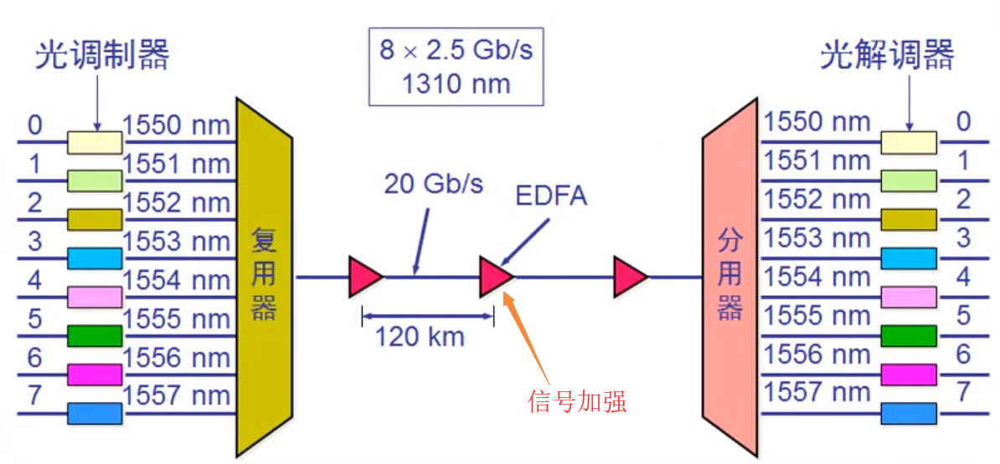

计算机网络笔记(计算机网络第七版 谢希仁著)
================
## 第一章: 概述
### 互联网的组成
```
边缘部分: 由所有连接在互联网上的主机组成, 这部分是由用户直接使用的
核心部分: 由大量网络和连接这些网络的路由器组成, 这部分是为边缘部分提供服务的(提供连通性和交换)
```
### 边缘部分端系统之间的通信方式(计算机之间的通信)
```
一: 客户端-服务器方式(C/S)
  概念: 客户和服务器都是指通信中所涉及的两个应用进程。客户是服务请求方, 服务器是服务提供方
  客户程序:
    <1> 被用户调用后运行, 在通信时主动向远地服务器发起通信。因此, 客户程序必须知道服务器程序的地址
    <2> 不需要特殊的硬件和很复杂的操作系统
  服务器程序:
    <1> 是一种专门用来提供某种服务的程序, 可同时处理多个远地或本地客户的请求
    <2> 系统启动后即自动调用并一直不断地运行着, 被动地等待并接收来自各地的客户的通信请求, 服务器程序不需要知道客户程序的地址	
  注意: 通信可以是双向的, 我们所说的B/S其实是C/S的一种特殊情况
二: 对等连接方式P2P
  概念: 是指两台主机在通信时不区分哪一个是服务请求方哪一个是服务提供方, 只要两台主机都运行了对等连接软件(P2P软件), 它们就可以进行平等的、对等连接通信
```
### 报文&&数据段&&分组&&包
```
报文: 通常我们把要发送的整块数据称为报文, 比如"你好"这个数据在经过应用层(应用层, 表示层, 会话层)的处理后则形成一个报文
数据段: 在发送报文之前, 先把较长的报文划分为一个个更小的等长数据段
分组&包: 对数据段加入一些头部(由一些必要的控制信息构成), 就构成了一个分组, 也叫包
```
### 核心部分: 分组交换
```
核心部分的主要部件是路由器, 它是一种专用计算机(不叫主机), 路由器是实现分组交换的的关键部件, 任务是转发收到的分组

电路交换主要特点: 经过"建立连接"(占用通信资源, 物理线路) => "通话"(一直占用通信资源) => "释放连接"(归还通信资源)三个步骤的交换方式电路交换会在主叫端 => 
                被叫端之间建立一条连接, 也就是一条专用的物理通路, 在通话时间内, 通话的两个用户时钟占用端到端的通信资源

分组交换的主要特点: 采用存储转发技术, 在传送数据之前不必先占用端到端的链路的通信资源, 只有在哪段链路上传送才占用这段链路的通信资源, 分组到达一个路由器
                  后, 先暂时存储下来, 查找转发表, 然后从一条合适的链路转发出去, 分组在传输时就这样一段段的断续占用通信资源, 还省去了建立连接和释放连接的开销

归纳: 
  电路交换: 整个报文的比特流连续地从原点直达终点, 就好像在一个管道中传送
  报文交换: 整个报文先传送到相邻节点(路由器), 全部存储下来后查找转发表, 转发到下一个节点
  分组交换: 单个分组(整个报文的一小部分)传送到相邻节点, 存储下来后查找转发表, 转发到下一个节点 
```
### 计算机网络的性能指标
```
一： 速率： 连接在计算机网络上的主机在数字信道上传送数据位数的速率, 也称为data rate或者bit rate
           宽带的100M是指每秒传输100M个比特位, 而我们看到的下载速度等10M是指每秒传输10M个字节, 所以其传输的基本单位是不一样的
二：带宽：数据通信领域中, 数字信道所能传送的最高数据率
三：吞吐量：即在单位时间内通过某个网路的数据量, 总的速率, 比如下载一个电影的速度是4M/s, 下载一个游戏的速度是3M/s, 两个下载
           同时进行, 所以同一时间内网卡的数据流量是7M/s, 即为吞吐量          
四：时延：一个数据（报文, 数据包等）从一个地方传送到另一个地方需要消耗的时间
      发送时延：一个文件从一台电脑开始发送到发送结束消耗的时间 => 发送时延 = 数据块长度(比特) / 信道带宽(比特/秒)
      传播时延：数据包在网线上传输的时间
      处理时延：路由器处理数据包的出口, 比如从A电脑发送了多个数据包, 到了路由器的时候, 需要对不同的数据包选择不同的传输路径, 消耗的时间 即为处理时延
      排对时延：路由器上, 有其他的包还没发送完成, 此时后面的包需要排对, 消耗的时间即为排对时延
五：时延带宽积: 传播时延 * 带宽, 表示同一时间在传输路径上最多有多少个比特在传输          
六：往返时间：从发送方发送数据开始, 到发送方收到接收方确认信息
七：利用率
      - 信道利用率: 有数据通过时间 / (有 + 无) 数据通过时间
      - 网络利用率：信道利用率加权平均值
```
### OSI参考模型(法定标准)
```
应用层: 所有能和用户交互产生网络流量的程序(如QQ, 但是记事本是不会产生流量的, 所以其不属于应用层), 主要协议: FTP(文件传输), SMTP(电子邮件), HTTP(万维网)
表示层: 用于处理在两个通信系统中交换信息的表示方式(语法语义), 主要协议: JPEG, ASCII
        功能一: 数据格式变换(翻译官)
        功能二: 数据加密解密
        功能三: 数据压缩和恢复(如视频聊天摄像头捕捉的头像是比较大的, 需要进行压缩再传输)
会话层: 向表示层实体/用户进程提供建立连接并在连接上有序地传输数据, 这叫会话, 也叫建立同步(如打开两个网页, 对它们分别建立了一个会话, 对一个网页地操作不会
        影响其它网页), 主要协议: ADSP, ASP
        功能一: 建立、管理、终止会话
        功能二: 使用校验点可使会话在通信失效时从校验点/同步点继续恢复通信, 实现数据同步, 如大文件的传输出现了断网, 则可以在校验点位置进行重新传输
传输层: 负责主机中两个进程的通信, 即端到端的通信, 传输单位是报文段或用户数据报, 主要协议: TCP, UDP
        功能一: 可靠传输(在目标主机返回了确认信息时才发送下一个数据包, 如果一定时间后没有确认信息则补发)、不可靠传输(一个数据包就可以解决数据发送), 可靠传输会传输多个包, 只有前一个包发送成功才发送下一个
        功能二: 差错控制
        功能三: 流量控制, 防止缓存满, 发送方和接收方的速率不一样
        功能四: 复用分用, 通过端口号来区分传输层的数据传送到哪个应用程序 
网络层: 主要任务是把分组从源端传送到目的端, 为分组交换网上的不同主机提供通信服务, 主要协议: IP, IPX, ICMP, IGMP, ARP, RARP,OSPF, 传输单位
        是数据报, 对于太大的数据报, 会将其分为多个分组来进行发送
        功能一: 路由选择(最佳路径)
        功能二: 流量控制
        功能三: 差错控制
        功能四: 拥塞控制, 如所有节点都来不及接收分组, 而要丢弃大量分组的话, 网络就处于拥塞状态。因此要采取一定的措施来缓解这种拥塞
数据链路层: 主要把网络层传下来的数据报组装成帧, 传输单位是帧, 主要协议: SDLC, HDLC, PPP, STP
        功能一: 成帧(定义帧的开始和结束)
        功能二: 差错控制(帧错+位错)
        功能三: 流量控制
        功能四: 访问控制, 控制信道的访问
物理层: 主要任务是在物理媒体上实现比特流的透明传输, 传输单位是比特, 透明传输是指不管所传数据是什么样的比特组合, 都应当能够在链路上传送, 主要协
        议: Rj45, 802.3
        功能一: 定义接口特性(如插口的孔的个数)
        功能二: 定义传输模式(单工、半双工、双工), 单工即固定了发送方和接收方, 半双工即双方都可以是发送方, 但是同一时间只能由
                一方发送数据, 双工即双方可以同时发送数据, 如打电话
        功能三: 定义传输速率(如何在物理链路上传输更快的速度)
        功能四: 比特同步
        功能五: 比特编码(用什么样的电压表示0和1)

TCP/IP参考模型(事实标准): 应用层, 传输层, 网际层, 网络接口层 
5层参考模型: 应用层(生成报文), 传输层(报文切割为报文段/数据段), 网络层(数据报/分组/包), 数据链路层(数据段成帧), 物理层(帧成比特流) 				
```
## 第二章: 物理层
### 物理层的基本概念
```
物理层: 解决如何在连接各种计算机的传输媒体上传输数据比特流, 而不是指具体的传输媒体(如光纤, 双绞线等不属于物理层)
主要任务：确定与传输媒体的接口有关的特性
        机械特性: 接口形状, 大小, 引线数目
        电气特性: 例如规定电压范围(-5V到+5V)
        功能特性: 例如规定-5V表示0, +5V表示1
        过程特性: 规定建立连接时各个相关部件的工作步骤  
```

### 数据通信的基础知识
#### 常用术语
```
通信的目的：传送消息
数据：运送消息的实体
信号：数据的电气的或者电磁的表现
    "模拟信号" 代表消息的参数的取值时连续的
    "数字信号" 代表消息的参数的取值是离散的
码元: 在使用时间域的波形表示数字信号时, 则代表不同离散数值的基本波形就称为码元。在数字通信中常常用时间间隔相同的符号来表示一个二进制数字, 
      这样的时间间隔内的信号称为二进制码元。而这个间隔被称为码元长度。一码元可以携带nbit的信息量
```
#### 信道
```
概念: 一般是用来表示向一个方向传送信息的媒体
信道中通信的方式: 
    - 单向通信(单工通信): 只能由一个方向的通信而没有反方向的交互, 例如电视机接收电视信号, 只能由电视台那边发送信号过来
    - 双向交替通信(半双工通信): 通信的双方都可以发送信息, 但不能双方同时发送, 也不能同时接收。例如对讲机
    - 双向同时通信(全双工通信): 通信的双方可以同时发送和接收信息。例如电话
```
#### 基带信号&带通信号
```
基带信号(在数字信道上传输): 来自信源的信号。像计算机输出的代表各种文字或图像文件的数据信号都属于基带信号。基带信号就是发出的直接表达了
                          要传输的信息的信号, 比如我们说话的声波就是基带信号, 再比如由物理层发出的二进制比特流也是基带信号
带通信号(在模拟信道上传输): 把基带信号经过载波调制后, 把信号的频率范围搬移到较高的频段以便在信道中传输

在传输距离较近时, 计算机网络都采用基带传输方式, 由于近距离范围内基带信号的衰减不大, 从而信号内容不会发生改变。
如计算机到监视器、打印机等外设的信号就是基带传输的, 而在网络上传输时, 由于传输距离较远(如北京到上海), 此时为了
能够防止信号衰减严重, 需要将基带信号调制成带通信号来在模拟信道上传输 
```

#### 基带信号的编码
```
编码的原因: 由于计算机传送的是二进制数据01, 那么在网络中传输时需要将其转换成电磁波来进行传输, 则用多大的电压来表示一个0和一个1
            就是对基带信号进行编码。
编码方式:
    单极性不归零码: 只使用一个电压值, 用高电平表示1, 没电压表示0
    双极性不归零码: 用正电平和负电平分别表示二进制数据的1和0, 正电平和负电平的值是相等的
    单极性归零码: 以高电平和零电平分别表示二进制码1和0, 而且在发送码1时高电平在整个码元期间T只持续一段时间x, 其余时间返回零电平
                (例如 11, 则其应该是连续的两个高电平信号, 但是每一个高电平信号代表完1后立马恢复成零电平, 然后再跳到高电平, 再恢复成零电平)
    双极性归零码: 正负零三个电平, 正电平代表1, 负电平代表0, 每代表完一个1和0都要跳转到零电平      

    不归零编码特点：编码容易, 但是没有检错功能, 无法判断一个码元的开始和结束, 以至于收发双方难以保持同步, 例如发送10个1, 则收方收到的是一连串的
                   高电平, 从而无法判断多少个1   
    曼彻斯特编码: 信号由低跳到高, 则高电平代表0, 信号由高跳到低, 则低电平代表1, 如果两个信号之间没有进行跳转,
                则两个信号的电平是一样的, 则说明没有网络(需要取样两次)
    差分曼彻斯特编码: 如果后一个是0则将后一个的电平和前一个保持一致, 如果后一个是1, 则将后一个的电平进行跳变,
                    比如两个连续的11, 其电平的表示方式是不一样的, 因为要进行跳变                    
```


- 基带信号

    

- 曼彻斯特编码

    
    

- 差分曼彻斯特编码

    
    

#### 基带信号的调制(将数字信号转换为模拟信号) 
- 调幅: 载波的振幅随基带数字信号而变化

    
- 调频: 载波的频率随基带数字信号而变化

    
- 调相: 载波的初始相位随基带数字信号而变化(对二进制0用开始从中点向上, 结束时从下到中点的波表示, 对二进制1用开始从中点向下, 结束时从上到中点的波表示)

    

#### 奈氏准则
```
奈氏准则: 在任何信道中, 码元传输的速率是有上限的, 否则就会出现码间串扰的问题, 使接收端对码元的识别成为不可能, 即当传输
         速率过快的时候, 一个码元的大小(宽度)就会变得很短, 如___变为了_ , 那么识别速度一定的情况下就可能导致识别失败
         如果信道的频带越宽, 也就是能够通过的信号高频分量越多, 那么就可以用更高的速率传送码元而不出现码间串扰
一句话: 奈氏准则告诉我们即使是没有干扰的情况下, 传输速率也是有上限的
```
#### 香农公式
```
香农公式: C = W * log(1 + S/N) b/s
        C：信道的极限传输速率, 即在带宽一定, 有噪声干扰的信道下, 能达到的极限、无差错的信息传输速率
        W：信道的带宽
        S：信道内所传信号的平均功率
        N：信道内部的噪声功率

例子1: A对B面对面说200个字, 在没有噪声干扰的情况下, 此时A的说话速度(带宽)能够让B无差错的听到说的话, 此时突然传来了
    工地的施工声音, 噪声很大, 为了能够让B无差错的听到这200个字, A需要降低说话的速度(带宽)才能达到

例子2: 电脑与WIFI路由器的距离为2米, 此时可以通过看网络状态信息中速率很高, 当电脑与WIFI路由器之间隔了一道墙, 或者一个房间
    此时为了达到无差错的信息传输, 需要降低传输速率

香农公式表明:
    <1> 信道的带宽(W)或信道中的信噪比(S/N)越大, 则信息的极限传输速率就越高
    <2> 只要信息传输速率低于信道的极限信息传输速率, 就一定可以找到某种方法来实现无差错的传输
    <3> 若信道带宽W或信噪比S/N没有上限(不可能), 则信道的极限信息传输速率C也就没有上限  
```
#### 基于香农公式提高传输速率
```
问题: 
    奈氏准则告诉我们传输速率是有上限的, 香农公式告诉我们带宽的大小和信噪比能够影响极限传输速率, 那么在带宽已经确定的信道,
    以及信噪比不能再提高时, 怎么去提高传输速率呢?

解决方案:
    用编码的方式让一个码元携带更多的比特, 例如: 加入我们的基带信号为 101011000110111010..., 如果直接传送, 则每一个码元所携带
    的信息量是1bit, 而编码是将二进制编制成一定的相位(如果为相位调制), 那么将3个比特作为一组, 即101, 010, 000, 110, 111, 010...
    3个比特共有8种情况, 则用8种不同的相位进行调制, 那么原来用18个码元才能表示的数据就用6个码元就可以表示了, 这样以相同速率去传送
    码元(带宽一定), 信噪比又一定的情况下, 就极大的提高了传输速率, 即使得传输速率无限的接近香农公式的值
```
### 物理层下面的传输媒体:
#### 导向传输媒体: 电磁波沿着固体媒体传播
- 双绞线
    - 屏蔽双绞线STP
    - 无屏蔽双绞线UTP
- 同轴电缆
    - 50Ω同轴电缆: 用于数字传输, 多用于基带传输, 也叫基带同轴电缆
    - 75Ω同轴电缆: 用于模拟传输, 即宽带同轴电缆
- 光缆(光纤)  

   

#### 非导向传输媒体: 无线传输

### 信道复用技术
#### 频分复用FDM: 用于打电话, 并且可以多次频分复用, 到达目的地后进行过滤和分用
```
不同的人之间的进行通话:如A-B, C-D, E-F 对A,B,C三者的声音采用不同的频率去进行声音的描述, 然后将这些频率经过调制, 从而在传输过程中不容易衰减
然后对这些调制后的频率叠加成一个总的频率表示, 最后在一个信道中进行这个频率的传输, 到达目的地后通过过滤器进行过滤, 过滤完后再进行解调, 解调完后
对频率进行还原, 此为分用。
```
  


#### 多次频分复用

 

#### 时分复用TDM
```
弊端: 可能会造成线路资源的浪费, 使用时分复用系统传送计算机数据时, 由于计算机数据的突发性质,
      用户对分配到的子信道的利用率一般是不高的。
```

 
 
 

#### 统计时分复用STDM: 对时分复用进行优化, 只接收有效值, 并对这些有效值进行标记, 这样接收方才能识别

 

#### 波分复用WDM：光的频分复用

 

#### 宽带接入技术      
```
ADSL上网实现机制: DMT技术
    利用电话线来同时进行打电话的信号和网络信号的传输, 其中用到的技术是频分复用技术, 电话线本身实际可通过的信号频率假设为1MHz, 那么将0-4kHz的
    频率给电话使用, 将40kHz-1100kHz给网络使用, 其中给网络使用的频率又进行细分, 将其分为多个信道, 因为上网主要的流量传输在于下载, 而对网页等请求则为上传, 
    上传用的流量是比较小的, 所以将这些信道中的25个用于上行信道, 249个用于下行信道, 所以这也是ADSL叫非对称数字用户线路的意思, 即提供的上行和下行宽带速率不对称             
光纤同轴混合王HFC: ADSL是复用电话线进行网络的数据通信, 而该技术是复用有线电视的同轴电缆, 同样是使用频分复用来对电视信号和网络信号进行分发 
FTTH技术(光纤到家)：直接将网络进行光纤传输, 不复用电话线和电视线, 还有光纤到大楼, 到路边
```
      
